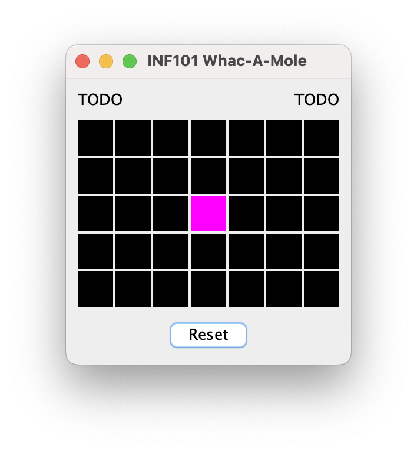

[Tilbake til README.md](./README.md)
# Whac-a-mole


Denne oppgaven består av flere deler, og gir tilsammen 35 poeng

 - [Introduksjon](#introduksjon)
     - [Oversikt over arkitektur](#oversikt-over-arkitektur)
 - [Oppvarming](#oppvarming) (4 poeng)
     - [Restriktive grensesnitt](#restriktive-grensesnitt)
 - [Grunnstruktur](#grunnstruktur) (15 poeng)
     - [Modell](#modell)
     - [Visning](#visning)
     - [Kontroll](#kontroll)
 - [Forbedringer](#forbedringer) (10 poeng)
     - [Reset](#reset)
     - [Poeng](#poeng)
     - [Hover-effekt](#hover-effekt)
     - [Timer](#timer)
 - [Uavhengige oppgaver](#uavhengige-oppgaver) (6 poeng)
     - [Abstrakte klasser](#abstrakte-klasser)
     - [Dokumentasjon for IteratorWrapper](#dokumentasjon-for-iteratorwrapper)

Merk at både *oppvarming* og *uavhengige oppgaver* kan gjøres helt uavhengig av de andre oppgavene.

## Introduksjon

I tivoli-spillet whac-a-mole er poenget å banke ned så mange muldvarper som mulig i løpet av en gitt tid. Hver gang en muldvarp blir banket, dukker det opp en ny muldvarp et tilfeldig sted, som så skal bankes ned. Dersom man banker ned veldig mange muldvarper, kan man vinne en premie.

I denne oppgaven skal du lage en digital versjon av whac-a-mole. Du bør følge instruksjonene slik at du demonstrerer at du forstår hva som menes. Dersom du avviker fra guiden på en fundamental måte kan du altså bli trukket poeng, selv om du mener din løsning er bedre enn den som er beskrevet her. Det er likevel bedre å ha en løsning som fungerer for deg enn å ikke ha en løsning i det hele tatt.

Du er nødt til å gjøre noen egne valg når du koder, særlig når det gjelder kodestil -- det er ofte flere måter å følge en instruksjon på, og hvor detaljerte instruksjonene er vil variere. Du må velge selv ting som tilgangsmodifikatorer, noen variabel- og metodenavn, kommentarer, javadoc, hvorvidt du deler opp kode i hjelpemetoder, om du ønsker å benytte flere grensesnitt og klasser enn det som er beskrevet, hvilke feltvariabler og konstanter du bruker og lignende. Noen ganger vil en endring som gjøres i én fil kreve at at det også blir gjort endringer i andre filer uten at det nødvendigvis påpekes i instruksjonene. Instruksjonene blir gradvis mindre detaljerte.

I repositoriet finner du kode for grid og observerbare verdier, som er basert på kode vi har sett på i kurset. Når vi refererer til Observable mener vi altså det som er i pakken *inf101v22.observable*, og *ikke* den Observable-klassen som finnes i Java sitt standard-biblitek.

Du kan allerede nå kjøre main-metoden i `App` og se et skjelett for programmet vi skal lage.


### Oversikt over arkitektur

Guiden vil følge design-prinsippet om model-view-controller. Det er én hovedklasse som er hovedansvarlig for hvert av de tre områdene, og for å synliggjøre skillet enda tydeligere lar vi alle klassene vi skriver være i en av pakkene *model*, *view* eller *controller*.

Det kan være greit å ha en oversikt over de viktigste metodene som utgjør kommunikasjonslinjene mellom modell, visning og kontroller før vi starter.

 - Modellen er uavhengig av både visning og kontrollen. Selve brettet representeres som et grid med `Character`.
 - Kontrollen får modellen gitt som argument ved opprettelse, og kan endre på den ved å kalle på metoder implementert i modellen. Det vil være en metode for å banke en muldvarp på en gitt lokasjon, samt en metode for å nullstille spillet.
 - Visningen får både modellen og kontrollen gitt som argument ved opprettelse. Den henter ut brettet som skal tegnes ved å kalle på en metode `getBoard` i modellen, og den videresender alle klikk til kontrollen ved å kalle metodene `tilePressed(Coordinate)` og `resetPressed` som er implementert i kontrolleren.

 For å øke modularitet og innkapsling, lar vi visningen kjenne til modellen bare gjennom et grensesnitt med metoder som ikke tillater at modellen endres.

 Vi lar modellen eksponere informasjonen om seg selv i form av observerbare (Observable) verdier, slik at visningen kan være ansvarlig for å tegne seg selv på nytt når modellen endrer seg uten hjelp fra kontrolleren.

Under vises et UML-diagram over de mest sentrale klassene i Whac-A-Mole. Dette viser stadiet etter at grunnstruktur og reset er implementert. Merk at diagrammet utelater mye, for eksempel er WhacAMoleView egentlig komponert av flere klasser.


## Oppvarming

### Restriktive grensesnitt

Denne deloppgaven er det ikke strengt nødvendig å gjennomføre for å gå videre, men det kan være litt lettere å gjøre den før du lager whac-a-mole enn etterpå. Testene i `ListOfListsGridTest` og `ControlledGridTest` skal passere både før og etter du er ferdig.

I pakken *inf101v22.grid* finner du grensesnittet `IGrid` og to klasser som implementerer det, `ListOfListsGrid` og `ControlledGrid`. Vi ønsker å dele opp grensesnittet i to, slik at vi i stedet har grensesnittene `GridReadable` og `GridWriteable`. Hensikten er at `GridReadable` skal være et restriktivt grensesnitt som ikke tillater at noen endrer på hvilke elementene som er i grid'et gjennom dette grensesnittet. Merk at siden `IGrid` er generisk, vil også de nye grensnittene vi oppretter være generiske.

- [ ] Gi nytt navn/refaktorer (bruk din IDE sine verktøy til dette) `IGrid` slik at det kalles `GridWritable` i stedet.
- [ ] Opprett et nytt grensesnitt `GridReadable` og la `GridWritable` være en utvidelse av dette.
- [ ] Flytt alle metode-definisjoer i `GridWriteable` som ikke endrer på grid'et til `GridReadable`.

Klassen `ControlledGrid` er en spesiell versjon av et grid som også har metoden `getObservable`. Opprett en restriktiv type som tillater å bruke metoden `getObservable`, men som ikke tillater endring av verdiene i gridet.

- [ ] Opprett et grensesnitt `GridObservable` som utvider `GridReadable`, og som definerer metodesignaturen til getObservable fra ControlledGrid. La `ControlledGrid` implementere dette grensesnittet (i tillegg).

## Grunnstruktur

### Modell

I dette steget skal vi lage en modell. For å representere et spill med Whac-A-Mole benytter vi oss av et grid av characters. Vi lar symbolet `x` bety at det er en muldvarp på en gitt lokasjon, og vi lar symbolet `-` bety at det ikke er en muldvarp der.

- [ ] Opprett en klasse `WhacAMoleModel` i pakken *inf101v22.whacamole.model*, og la den ha en feltvariabel av typen `ControlledGrid<Character>` som representerer brettet. 
- [ ] Initialiser feltvariabelen. Et standard brett har 5 rader og 7 kolonner.
- [ ] Opprett en metode som setter alle posisjoner på brettet til `-` bortsett fra den midterste posisjonen på brettet, der det skal være en `x`. Vi planlegger at denne metoden skal bli kalt når brukeren trykker reset. Gjør et kall til den i konstruktøren også.

Det er to ting spilleren kan gjøre som vil endre modellen. Det éne er å trykke reset, det andre er å whac'e en muldvarp.

- [ ] Opprett en metode som tar en `Coordinate` som parameter. Tanken er at metoden vil bli kalt når brukeren klikker på en flis på brettet, og skal ha en effekt dersom det er en muldvarp i den gitte posisjonen. Da:
    - [ ] forsvinner muldvarpen ned i hullet sitt, og
    - [ ] det dukker opp en ny muldvarp på en tilfeldig lokasjon på brettet (bruk `Random` -klassen fra java sitt standard-bibliotek for å generere en tilfeldig rad og en tilfeldig kolonne).

Vi er nå ferdige med en helt basic modell. Vi skal utvide modellen senere med hvilket modus vi er i, poengsum, hvilket tidspunkt tiden er ute, og hvilken tekst brukeren leser; men først skal vi konsentrere oss om å få visningen og kontrollen til å fungere.

Visningen må ha tilgang til modellen for å kunne vise den, men vi ønsker ikke at visningen skal kunne endre modellen. Derfor vil vi opprette et restriktivt grensesnitt `WhacAMoleViewable` som `WhacAMoleModel` skal implementere:

 - [ ] La grensesnittet definere en metode som henter ut brettet. La returtypen til metoden være restriktiv, i.e. benytt `GridObservable<Character>`. (Hvis du ikke har gjort oppgaven om restriktive grensesnitt kan du benytte `ControlledGrid<Character>` som returtype -- det vil fungere, men innkapslingen vil være dårligere). Implementer metoden i modellen.

 Til slutt må vi opprette modellen.

  - [ ] Opprett et `WhacAMoleModel` -objekt i `App`.


### Visning

For at visningen skal kunne tegne modellen, må den ha tilgang til den.
 - [ ] Utvid konstrutøren til `WhacAMoleView` med en parameter av typen `WhacAMoleViewable`, altså modellen som skal tegnes. Oppdater `App` slik at modellen opprettet i forrige avsnitt gis som argument ved opprettelsen av visning-objektet.

I `WhacAMoleView` opprettes det i starter-koden et HeadUpDisplay -objekt, et JLabel-objekt og et ButtonsPanel -objekt. Vi skal bytte ut JLabel-objektet med visningen vår for selve brettet, som altså legges til i CENTER.
 - [ ] Bytt ut JLabel-objektet med et `BoardView` -objekt (forklart under).

Opprett to klasser:
 - [ ] En klasse `BoardView` som utvider `JComponent` og har ansvar for å tegne hele brettet.
 - [ ] En klasse `TileView` som utvider `JComponent` og har ansvar for å tegne én flis på brettet.

I konstruktøren til `BoardView`:

 - [ ] La det være en parameter for brettet som skal tegnes.

 - [ ] Benytt metoden `setLayout` som er arvet fra JComponent-klassen. Sett layout til å være et nytt objekt av typen `java.awt.GridLayout`. Bruk konstruktøren som tar fire argumenter når du oppretter GridLayout-objektet: antall rader, antall kolonner, avstand vertikalt og avstand horisontalt. Velg selv en pen vertikal og horisontal avstand (i illustrasjonen til denne guiden er det brukt en avstand på 2 piksler).
 - [ ] For hvert koordinat på brettet, opprett et `TileView` -objekt og legg det til med `add` -metoden som er er arvet fra JComponent. Benytt `add` -metoden som tar tre argumenter: det første argumentet er `TileView`-objektet som skal legges til, de to neste er henholdvis rad og kolonne.

 I `TileView`:

- [ ] La konstruktøren ha en `Observable<Character>` som parameter. Dette er variabelen i modellen som representerer flisen på brettet dette TileView-objektet har ansvar for å tegne. Kall `addObserver` på observable-objektet med `this::repaint` som argument, slik at repaint blir kalt på dette TileView -objektet hver gang den observerbare verdien endrer seg.

- [ ] Overskriv metoden `preferredSize` som returnerer en `java.awt.Dimension`, og la den returnere en passende verdi (illustrasjonen til denne guiden bruker 30, 30).

- [ ] Overskriv metoden med signatur `void paintComponent(java.awt.Graphics)`
    - [ ] Sett farge ved å bruke `setColor` -metoden på Graphics-objektet. La fargen være avhengig av hvilken verdi character-variabelen vi observerer har. I illustrasjonene til denne guiden brukte vi Color.BLACK dersom verdien er `-` og Color.MAGENTA dersom den er `x`.
    - [ ] Bruk `fillRect` -metoden på Graphics-objektet for å tegne en firkant som fyller hele ruten dette objektet har ansvar for (bruk getWidth og getHeight arvet fra JComponent for å vite bredde og høyde).

> Hint til opprettelsen av TileView -objekter i BoardView: husker du hvilken metode som var spesiell for ObservableGrid/ControlledGrid?

Du skal nå kunne kjøre programmet og se brettet som vist under. Hvis du har initialisert modellen med en `x` på midten av brettet, skal dette være synlig i visningen ved at flisen har en annen farge enn de andre.




### Kontroll

Klikk i rutenettet skal ende opp med å kalle metoden som banker ned en muldvarp i modellen. I henhold til model-view-controller skal programflyten innom en kontroller på veien.

 - [ ] Opprett en klasse `WhacAMoleController` i pakken *inf101v22.whacamole.controller*. La konstruktøren ta inn modellen som parameter, og la den ha en metode `tilePressed` med en parameter av typen `Coordinate` som enkelt og greit kaller på metoden i modellen som banker en muldvarp.

 - [ ] Opprett et kontroller-objekt i `App`. Utvid konstruktørene til visning-klassene etter behov slik at de får kontrolleren med seg som argument under konstruksjon.

 - [ ] La `TileView` implementere grensesnittet `java.awt.event.MouseListener`, og la den legge til seg selv som mouseListener i konstruktøren:

 ```java
this.addMouseListener(this);
 ```
 
 - [ ] I `mousePressed` -metoden, gjør et kall til `tilePressed` -metoden i kontrolleren. For å vite hvilket koordinat som skal benyttes som argument, kan konstruktøren til `TileView` selv ha dette som parameter.

Når du nå kjører programmet skal du kunne klikke på muldvarpen og den vil flytte seg til en annen tilfeldig rute på brettet.


## Forbedringer

### Reset

La reset-knappen resette spillet.

- [ ] La kontroller-klassen ha en public metode med signatur `void resetPressed(java.awt.event.ActionEvent)` som kaller på metoden som initierer spillet i modellen.

- [ ] La konstruktøren til `ButtonsPanel` ha kontrolleren som en parameter, og la den ha variabelnavnet `controller`.
Gjør et kall til metoden `addActionListener(java.awt.event.ActionListener)` på `resetButton` -objektet. La argumentet til metodekallet være `controller::resetPressed`.

Når du nå spiller spillet, vil et trykk på reset-knappen tilbakestille muldvarpen til sentrum av brettet.

### Poeng

Legg til visning av poeng.

- [ ] La modellen ha en feltvariabel av typen `ControlledObservable<Integer>` som settes til 0 i metoden som initialiserer brettet til utgangsposisjonen, og som økes med 1 hver gang brukeren banker en muldvarp.

- [ ] La modellen (via det restriktive grensesnittet visningen har tilgang på) eksponere poengsummen som en `Observable<Integer>`.

- [ ] La `HeadUpDisplay` ha en parameter i konstruktøren `Observable<Integer>` som er poengsummen som skal vises. Opprett en metode `void updateScore()` som omgjør poengsummen til en String og kaller `setText` -metoden på det JLabel-objektet som vises til høyre i visningen. Legg `this::updateScore` til som observatør, og gjør også et kall til updateScore på slutten av konstruktøren.

Poengsummen skal nå økes hver gang du banker en muldvarp, og nullstilles når du klikker reset.


### Hover-effekt

Når musenpekeren holdes over muldvarpen, bør flisen lyse opp med en lysere farge (se illustrajson øverst). Utnytt `mouseEntered` og `mouseExited` -metodene i `TileView`, og tegn f. eks. en hvit og delvis gjennomsiktig firkant oppå den orginale firkanten når musen er over flisen (delvis gjennomsiktig hvit-farge: `new Color(0xff, 0xff, 0xff, 0x60)`).

### Timer

Når spilleren banker den første muldvarpen startes en timer på 20 sekunder, og antall gjenværende sekunder vises i headup- display. Når tiden er ute forsvinner muldvarpen, og en melding til spilleren vises. Ved trykk på reset, resettes spillet og er klart til å startes på nytt. Se animasjon helt øverst i denne oppgaven.

Dette innebærer av vi har tre overordnede tilstander spillet kan være i:
 - klart for start
 - i aktiv fase, og
 - spillet er over

I modellen:
 - [ ] Husk på spillets fase.
 - [ ] Eksponér en observerbar String-variabel for teksten som skal vises oppe til venstre i spillet (også eksponert i `WhacAMoleViewable`)
 - [ ] La det være en feltvariabel av typen `LocalDateTime` som forteller hvilket tidspunkt tiden er ute. Sett denne variabelen til `LocalDateTime.now().plus(Duration.ofSeconds(<antall sekunder>))` når spillet skifter til aktiv fase. (Klassene LocalDateTime og Duration finnes i pakken *java.time*)
 - [ ] La det være en klokkeslag-metode som regner ut spillets tilstand, og som går fra aktiv fase til at spillet er over dersom tiden er utløpt. Vi planlegger å kalle denne metoden 60 ganger i sekundet. Her kan vi også regne ut verdien for String som skal vises oppe til venstre.

 > Hint: Sjekk ut metoden `between` i Duration-klassen som kan ta to `LocalDateTime` -objekter som input når du skal regne ut hvor mye tid som gjenstår. Duration -objektet du da får har metoder `getSeconds` og `toMillisPart` som kan være ganske hendige.

 > Et annet hint: Sjekk dokumentasjonen til [LocalDateTime](https://docs.oracle.com/en/java/javase/17/docs/api/java.base/java/time/LocalDateTime.html) for å se om det er metoder der du kan få brukt for.

 I kontrolleren:
 - [ ] Ha et Timer-objekt med intervall på 1000/60 millisekunder som periodisk kaller på klokkeslag-metoden i modellen.

I visningen:
 - [ ] Vis teksten oppe til venstre på samme måte som vi gjorde i forrige avsnitt da vi viste poengene.

## Uavhengige oppgaver

### Abstrakte klasser

Ser du noen likheter mellom `ListOfListsGrid` og `ControlledGrid`? Er det noen av metodene som er like?

 - [ ] Opprett en ny abstrakt klasse `AbstractGrid` som samler felles kode for `ListOfListsGrid` og `ControlledGrid`. Prøv å samle så mye kode som mulig i `AbstractGrid`.

Tenk over hvord den nye klassen bør sitte i type-hierarkiet.

 Testene i `GridTest` skal passere både før og etter du er ferdig.


### Dokumentasjon for IteratorWrapper

I pakken *inf101v22.utils* ligger klassen `IteratorWrapper`, men den mangler javadocs! Skriv javadocs for klassen og for konstrutøren hvor du forklarer hvordan den skal brukes og gir et eksempel på bruk som er godt forklart/enkelt å forstå.
