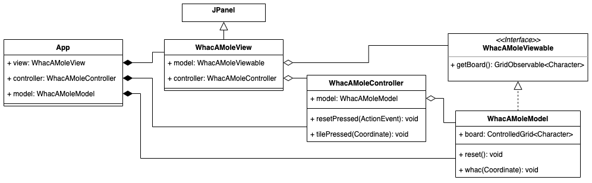

[Back to README.md](./README.md)
# Whac-a-mole


This task consists of several parts, and gives a total of 35 points

  - [Introduction](#introduction)
      - [Architecture overview](#overview-of-architecture)
  - [Warmup](#warmup) (4 points)
      - [Restrictive interfaces](#restrictive-interfaces)
  - [Basic structure](#basic-structure) (15 points)
      - [Model](#model)
      - [View](#view)
      - [Controller](#controller)
  - [Improvements](#improvements) (10 points)
      - [Reset](#reset)
      - [Score](#score)
      - [Hover effect](#hover-effect)
      - [Timer](#timer)
  - [Independent Tasks](#independent-tasks) (6 points)
      - [Abstract classes](#abstract-classes)
      - [IteratorWrapper Documentation](#iteratorwrapper-documentation)

Note that both * heating * and * independent tasks * can be done completely independently of the other tasks.

## Introduction

In the tivoli game whac-a-mole, the point is to knock down ("whac") as many moles as possible in a given amount of time. Every time a mole is knocked, a new mole appears in a random place, which must then be knocked down. If you knock down a lot of moles, you can win a prize.

In this exercise you will create a digital version of whac-a-mole. You should follow the instructions so that you demonstrate that you understand what is meant. If you deviate from the guide in a fundamental way, you may be deducted points even if it can be argued that your solution is better than the one described here. It is still better to have a solution that works for you than not to have a solution at all.

You have to make your own choices when coding, especially when it comes to coding style - there are often several ways to follow an instruction, and how detailed the instructions are will vary. You have to choose things like access modifiers, some variable and method names, comments, javadoc, whether you divide code into auxiliary methods, whether you want to use more interfaces and classes than described, which field variables and constants you use and the like. Sometimes a change made to one file will require that changes be made to other files without necessarily being pointed out in the instructions. The instructions gradually become less detailed.

In the repository you will find code for grid and observable values, which is based on code we have looked at in the course. When we refer to Observable, we mean what is in the package *inf101v22.observable*, and *not* the Observable class found in Java's standard library.

You can already run the main method in the `App` and see a skeleton for the program we are going to create.

### Overview of architecture

The guide will follow the design principle of model-view-controller. There is one main class that is mainly responsible for each of the three areas, and to make the distinction even clearer, we leave all the classes we write in one of the packages *model*, *view* or *controller*.

It can be good to have an overview of the most important methods that make up the lines of communication between model, view and control before we start.

 - The model is independent of both view and controller. The board itself is represented as a grid of `Character`.
 - The controller receives the model as an argument when being constructed, and can change it by calling on methods implemented in the model. There will be a method to whac a mole in a given location, as well as a method to reset the game.
 - The view recieves both the model and the control as arguments upon construction. It retrieves the board to be drawn by calling a method `getBoard` on the model, and it forwards all clicks and interacitons to the control by calling the methods `tilePressed(Coordinate)` and `resetPressed` implemented in the controller.

 To increase modularity and encapsulation, we let the view know about the model only through an interface with methods that do not allow the model to be mutated.

 We let the model expose information about itself in the form of observable values, so that the view can be responsible for redrawing itself when the model changes without any aid of the controller.

Below is a UML chart of the most central classes in Whac-A-Mole. This shows the stage after the basic structure and reset have been implemented. Note that the chart omits a lot, for example that WhacAMoleView is actually composed of several classes.



## Warmup

### Restrictive interfaces

This subtask is not strictly necessary to complete in order to proceed, but it may be a little easier to do it before creating whac-a-mole than afterwards. The tests in `ListOfListsGridTest` and `ControlledGridTest` must pass both before and after you finish.

In the package *inf101v22.grid* you will find the interface `IGrid` and two classes that implement it, `ListOfListsGrid` and `ControlledGrid`. We want to split the interface in two, so that we instead have the interfaces `GridReadable` and `GridWriteable`. The intention is that `GridReadable` should be a restrictive interface that does not allow anyone to change which elements are in the grid through this interface. Note that since `IGrid` is generic, the new interfaces we create will also be generic.

- [ ] Rename / refactor (use the tools your IDE provides for this) `IGrid` so that it is called` GridWritable` instead.
- [ ] Create a new interface `GridReadable` and let `GridWritable` be an extension of this.
- [ ] Move all method definition years in `GridWriteable` that do not change the grid to `GridReadable`.

The `ControlledGrid` class is a special version of a grid that also has the `getObservable` method. Create a restrictive type that allows the `getObservable` method to be used, but does not allow changing the values ​​in the grid.

- [ ] Create an interface `GridObservable` that extends `GridReadable`, and which defines the method signature of getObservable from ControlledGrid. Let `ControlledGrid` implement this interface (in addition).


## Basic structure

### Model

In this step we make a model. To represent a game with Whac-A-Mole, we use a grid of characters. We let the symbol `x` mean that there is a mole in a given location, and we let the symbol` -` mean that there is not a mole there.

- [ ] Create a class `WhacAMoleModel` in the package *inf101v22.whacamole.model*, and let it have a field variable of the type `ControlledGrid<Character>` representing the board.
- [ ] Initialize the field variable. A standard board has 5 rows and 7 columns.
- [ ] Create a method that sets all positions on the board to `-` except the middle position on the board, where there should be an `x`. We plan to call this method when the user presses reset. Make a call to it in the constructor as well.

There are two things the player can do that will change the model. One is to press reset, the other is to whac a mole.

- [ ] Create a method that takes a `Coordinate` as a parameter. The idea is that the method will be called when the user clicks on a tile on the board, and should have an effect if there is a mole in the given position. Then:
    - [ ] the mole disappears into its hole, and
    - [ ] a new mole appears in a random location on the board (use the `Random` class from java's default library to generate a random row and a random column).

We are now done with a completely basic model. We will expand the model later with what phase we are in, score, at what time the time runs out, and which message the user reads; but first we go on to make the view and controller work.

The view must have access to the model in order to view it, but we do not want the view to be able to change the model. Therefore, we will create a restrictive interface `WhacAMoleViewable` that `WhacAMoleModel` should implement:

 - [ ] Let the interface define a method that retrieves the board. Let the return type of the method be restrictive, i.e. use `GridObservable<Character>`. (If you have not done the task of restrictive interfaces, you can use `ControlledGrid<Character>` as the return type instead - it will work, but the encapsulation will be worse). Implement the method in the model.

 Finally, we need to create the model.

  - [ ] Create a `WhacAMoleModel` object in ` App`.

### View

In order for the display to be able to draw the model, it must have access to it.
 - [ ] Extend the constructor to `WhacAMoleView` with a parameter of the type `WhacAMoleViewable`, i.e. the model to be drawn. Update `App` so that the model created in the previous section is given as an argument when creating the view object.

In `WhacAMoleView`, the starter code creates a HeadUpDisplay object, a JLabel object, and a ButtonsPanel object. We will replace the JLabel object with our view for the board itself (added to CENTER).
 - [ ] Replace the JLabel object with a `BoardView` object (explained below).

Create two classes:
 - [ ] A class `BoardView` that extends` JComponent` and is responsible for drawing the entire board.
 - [ ] A class `TileView` that extends` JComponent` and is responsible for drawing one tile on the board.

In the constructor of `BoardView`:

 - [ ] Let there be a parameter for the board to be drawn.
 - [ ] Use the `setLayout` method inherited from the JComponent class. Set the layout to be a new object of type `java.awt.GridLayout`. Use the constructor that takes four arguments when creating the GridLayout object: number of rows, number of columns, gap vertically, and gap horizontally. Choose a nice vertical and horizontal distance for the gap yourself (in the illustration of this guide, a gap of 2 pixels is used).
 - [ ] For each coordinate on the board, create a `TileView` object and add it using the `add` method inherited from JComponent. Use the `add` method which takes three arguments: the first argument is the` TileView` object to be added, the next two are row and column respectively.


 In `TileView`:

- [ ] Let the constructor have an `Observable<Character>` as parameter. This is the variable in the model that represents the tile on the board this TileView object is responsible for drawing. Call `addObserver` on the observable object with `this::repaint` as the argument, so that repaint is called on this TileView object every time the observable value changes.

- [ ] Overwrite the `preferredSize` method that returns a `java.awt.Dimension` and let it return an appropriate value (the illustration in this guide uses 30, 30).

- [ ] Overwrite the method with signature `void paintComponent (java.awt.Graphics)`
    - [ ] Set color using the `setColor` method on the Graphics object. Let the color depend on the value of the character variable we observe. In the illustrations of this guide we used Color.BLACK if the value is `-` and Color.MAGENTA if it is `x`.
    - [ ] Use the `fillRect` method on the Graphics object to draw a square that fills the entire area this object is responsible for (use getWidth and getHeight inherited from JComponent to know width and height).

> Hint for creating TileView objects in BoardView: Do you remember which method was specific to ObservableGrid / ControlledGrid?

You should now be able to run the program and see the board as shown below. If you have initialized the model with an `x` in the middle of the board, this should be visible in the view because the tile has a different color than the others.


### Controller

Clicking in the grid should end up calling the method that knocks down a mole in the model. According to model-view-controller, the program flow must pass through a controller.

 - [ ] Create a class `WhacAMoleController` in the package *inf101v22.whacamole.controller*. Let the constructor have the model as a parameter, and let it have a method `tilePressed` with a parameter of the type `Coordinate` that simply calls the method in the model that knocks a mole.

 - [ ] Create a controller object in `App`. Extend the constructors of the view classes as needed so that they accept the controller as an argument for construction.

 - [ ] Let `TileView` implement the `java.awt.event.MouseListener` interface, and let it add itself as mouseListener in the constructor:
```java
this.addMouseListener(this);
```
 
- [ ] In `mousePressed`, make a call to `tilePressed` on the controller. To know which coordinate to use as an argument, the constructor of `TileView` can have this as a parameter.

When you now run the program you should be able to click on the mole and it will move to another random location on the board.


## Improvements

### Reset

Let the reset button reset the game.

- [ ] Let the controller class have a public method with the signature `void resetPressed (java.awt.event.ActionEvent)` which calls for the method that initiates the game in the model.
- [ ] Let the constructor of the `ButtonsPanel` take the controller as a parameter, and let it have the variable name `controller`.
Make a call to the method `addActionListener(java.awt.event.ActionListener)` on the `resetButton` object. Let the argument to the method call be `controller::resetPressed`.

When you now play the game, pressing the reset button will reset the mole to the center of the board.


### Score

Add points to the game.

- [ ] Let the model have a field variable of the type `ControlledObservable<Integer>` which is set to 0 in the method that initializes the board to the starting position, and which is increased by 1 each time the user knocks a mole.

- [ ] Let the model (via the restrictive interface the view has access to) expose the score as an `Observable <Integer>`.

- [ ] Let `HeadUpDisplay` have a parameter in the constructor `Observable <Integer>` which is the score to be displayed. Create a `void updateScore()` method that converts the score to a String and calls the `setText` method on the JLabel object displayed to the right of the view. Add `this::updateScore` as an observer, and also make a call to updateScore in the constructor.

The score should now be increased each time you whac a mole, and will be reset when you click reset.

### Hover effect

When the mouse pointer is held over the mole, the tile should light up with a lighter color (see illustration above). Utilize the `mouseEntered` and `mouseExited` methods in `TileView`, and draw e.g. a white and partially transparent square on top of the original square when the mouse is over the tile (partially transparent white: `new Color(0xff, 0xff, 0xff, 0x60)`).

### Timer

When the player knocks on the first mole, a timer of 20 seconds is started and the number of remaining seconds is shown in the headup display. When the time is up, the mole disappears and a message is displayed to the player. By pressing reset, the game is reset and is ready to restart. See animation at the very top of this writeup.

This means we have three main states the game can be in:
 - ready to start
 - the active phase, and
 - the game is over

In the model:
 - [ ] Remember the phase of the game.
 - [ ] Expose an observable String variable for the text to be displayed in the upper left of the game (also exposed in `WhacAMoleViewable`)
 - [ ] Let there be a field variable of the type `LocalDateTime` which tells what time the time is out. Set this variable to `LocalDateTime.now().plus(Duration.ofSeconds(<number of seconds>))` when the game switches to active phase. (The LocalDateTime and Duration classes are included in the *java.time* package)
 - [ ] Let there be a clock method that calculates the state of the game, and which goes from the active phase to the game being over if the time has expired. We plan to call this method 60 times a second. Here we can also calculate the value for String to be displayed at the top left.

 > Hint: Check out the `between` method in the Duration class that can take two` LocalDateTime` objects as input when calculating how much time is left. The Duration object you then get has methods `getSeconds` and` toMillisPart` which can be quite handy.

 > Another hint: Check the documentation for [LocalDateTime] (https://docs.oracle.com/en/java/javase/17/docs/api/java.base/java/time/LocalDateTime.html) to see if it is methods that you can get used to.

 In the controller:
 - [ ] Have a Timer object with an interval of 1000/60 milliseconds that periodically calls the time method in the model.

In the view:
 - [ ] Show the text at the top left in the same way as we did in the previous section when we showed the points.


## Independent tasks

### Abstract classes

Do you see any similarities between `ListOfListsGrid` and` ControlledGrid`? Are any of the methods similar?

  - [ ] Create a new abstract class `AbstractGrid` that collects common code for` ListOfListsGrid` and `ControlledGrid`. Try to collect as much code as possible in `AbstractGrid`.

Consider how the new class should sit in the type hierarchy.

The tests in `GridTest` must pass both before and after you finish.


### Documentation for IteratorWrapper

In the package *inf101v22.utils* is the class `IteratorWrapper`, but it lacks javadocs! Write javadocs for the class and its constructor where you explain how to use it and give an example of use that is well explained / easy to understand.