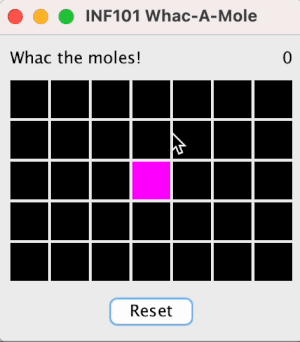
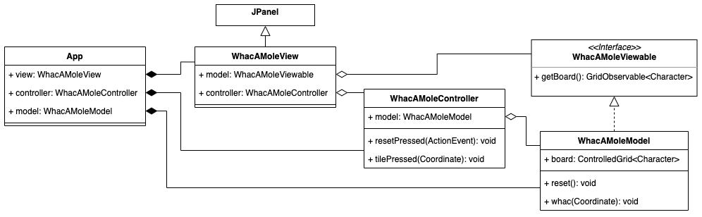
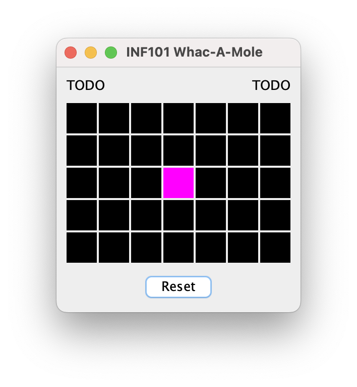

[Attende til README.md](./README.md)
# Whac-a-mole



Denne oppgåva består av fleire delar, og gir tilsaman 35 poeng

 - [Introduksjon](#introduksjon)
     - [Oversyn over arkitektur](#oversyn-over-arkitektur)
 - [Oppvarming](#oppvarming) (4 poeng)
     - [Restriktive grensesnitt](#restriktive-grensesnitt)
 - [Grunnstruktur](#grunnstruktur) (15 poeng)
     - [Modell](#modell)
     - [Visning](#visning)
     - [Kontroll](#kontroll)
 - [Betringar](#betringar) (10 poeng)
     - [Reset](#reset)
     - [Poeng](#poeng)
     - [Hover-effekt](#hover-effekt)
     - [Nedteljing](#nedteljing)
 - [Uavhengige oppgåver](#uavhengige-oppgåver) (6 poeng)
     - [Abstrakte klassar](#abstrakte-klassar)
     - [Dokumentasjon for IteratorWrapper](#dokumentasjon-for-iteratorwrapper)

Merk at både *oppvarming* og *uavhengige oppgåver* kan gjerast heilt uavhengig av dei andre oppgåvene.

## Introduksjon

I tivoli-spelet whac-a-mole er poenget å banka ned så mange muldvarper som mogleg i løpet av ein gitt tid. Kvar gang ein muldvarp blir banka, dukkar det opp ein ny muldvarp ein tilfeldig stad, som så skal bankast ned. Dersom ein bankar ned veldig mange muldvarper, kan ein vinna ein premie.

I denne oppgåva skal du laga ein digital versjon av whac-a-mole. Du bør følgja instruksjonane slik at du demonstrerer at du forstår kva som blir meint. Dersom du avvik frå guiden på ein fundamental måte kan du altså bli trekt poeng, sjølv om du meiner løysinga di er betre enn den som er beskrive her. Det er likevel betre å ha ei løysing som fungerer for deg enn å ikkje ha ei løysing i det heile.

Du er nøydd til å gjera nokon eigne val når du kodar, særleg når det gjeld kodestil -- det er ofte fleire måtar å følgja ein instruksjon på, og kor detaljerte instruksjonane er vil variera. Du må velja sjølv ting som tilgangsmodifikatorer, nokon variabel- og metodenamn, kommentarar, javadoc, i kva grad du deler opp kode i hjelpemetodar, om du ynskjer å nytta fleire grensesnitt og klassar enn det som er beskrivne, kva feltvariablar og konstantar du brukar og liknande. Nokon gangar vil ei endring som blir gjord i éi fil krevja at at det òg blir gjort endringar i andre filer utan at det nødvendigvis blir påpeika i instruksjonane. Instruksjonane blir gradvis mindre detaljerte.

I repositoriet finn du kode for grid og observerbare verdiar, som er baserte på kode vi har sett på i kurset. Når vi refererer til Observable meiner vi altså det som er i pakken *inf101v22.observable*, og *ikkje* den Observable-klassen som finst i Java sitt standard-biblitek.

Du kan allereie no køyra main-metoden i `App` og sjå eit skjelett for programmet vi skal laga.


### Oversyn over arkitektur

Guiden vil følgja design-prinsippet om model-view-controller. Det er éin hovudklasse som er hovudansvarleg for kvart av dei tre områda, og for å synleggjera skiljet endå tydelegare lèt vi alle klassane vi skriv vera i ein av pakkane *model*, *view* eller *controller*.

Det kan vera greitt å ha ei oversyn over dei viktigaste metodane som utgjer kommunikasjonslinjene mellom modell, visning og kontrollar før vi startar.

 - Modellen er uavhengig av både visning og kontrollen. Sjølve brettet blir representert som eit grid med `Character`.
 - Kontrollen får modellen gitt som argument ved skiping, og kan endra på han ved å kalla på metodar implementert i modellen. Det vil vera ein metode for å banka ein muldvarp på ein gitt lokasjon, og dessutan ein metode for å nullstille spelet.
 - Visninga får både modellen og kontrollen gitt som argument ved skiping. Han hentar ut brettet som skal teiknast ved å kalla på ein metode `getBoard` i modellen, og den vidaresender alle klikk til kontrollen ved å kalla metodane `tilePressed(Coordinate)` og `resetPressed` som er implementert i kontrolleren.

 For å auka modularitet og innkapsling, lèt vi visninga kjenne til modellen berre gjennom eit grensesnitt med metodar som ikkje tillèt at modellen blir endra.

 Vi lèt modellen eksponera informasjonen om seg sjølv i form av observerbare (Observable) verdiar, slik at visninga kan vera ansvarleg for å teikna seg sjølv på nytt når modellen endrar seg utan hjelp frå kontrolleren.

Under blir vist eit UML-diagram over dei mest sentrale klassane i Whac-A-Mole. Dette viser stadiet etter at grunnstruktur og reset er implementert. Merk at diagrammet utelèt mykje, til dømes er WhacAMoleView eigentleg komponert av fleire klassar.


## Oppvarming

### Restriktive grensesnitt

Denne deloppgåva er det ikkje strengt nødvendig å gjennomføra for å gå vidare, men det kan vera litt lettare å gjera ho før du lagar whac-a-mole enn etterpå. Testane i `ListOfListsGridTest` og `ControlledGridTest` skal passera både før og etter du er ferdig.

I pakken *inf101v22.grid* finn du grensesnittet `IGrid` og to klassar som implementerer det, `ListOfListsGrid` og `ControlledGrid`. Vi ynskjer å dela opp grensesnittet i to, slik at vi i staden har grensesnitta `GridReadable` og `GridWriteable`. Hensikta er at `GridReadable` skal vera eit restriktivt grensesnitt som ikkje tillèt at nokon endrar på kva elementa som er i grid'eit gjennom dette grensesnittet. Merk at sidan `IGrid` er generisk, vil òg dei nye greinsnitta vi opprettar vera generiske.

- [ ] Gi nytt namn/refaktorer (bruk verktøya i din IDE til dette) `IGrid` slik at det kallast `GridWritable` i staden.
- [ ] Opprett eit nytt grensesnitt `GridReadable` og la `GridWritable` vera ei utviding av dette.
- [ ] Flytt alle metode-definisjoer i `GridWriteable` som ikkje endrar på grid'eit til `GridReadable`.

Klassen `ControlledGrid` er ein spesiell versjon av eit grid som også har metoden `getObservable`. Opprett ein restriktiv type som tillèt å bruka metoden `getObservable`, men som ikkje tillèt endring av verdiane i gridet.

- [ ] Opprett eit grensesnitt `GridObservable` som utvidar `GridReadable`, og som definerer metodesignaturen til getObservable frå ControlledGrid. La `ControlledGrid` implementera dette grensesnittet (i tillegg).

## Grunnstruktur

### Modell

I dette steget skal vi laga ein modell. For å representera eit spel med Whac-A-Mole nyttar vi oss av eit grid av characters. Vi lèt symbolet `x` bety at det er ein muldvarp på ein gitt lokasjon, og vi lèt symbolet `-` bety at det ikkje er ein muldvarp der.

- [ ] Opprett ein klasse `WhacAMoleModel` i pakken *inf101v22.whacamole.model*, og la han ha ein feltvariabel av typen `ControlledGrid<Character>` som representerer brettet. 
- [ ] Initialisar feltvariabelen. Eit standard brett har 5 rader og 7 kolonnar.
- [ ] Opprett ein metode som set alle posisjonar på brettet til `-` bortsett frå den midterste posisjonen på brettet, der det skal vera ein `x`. Vi planlegg at denne metoden skal bli kalla når brukaren trykker reset. Gjer eit kall til han i konstruktøren òg.

Det er to ting spelaren kan gjera som vil endra modellen. Det eine er å trykka reset, det andre er å whac'e ein muldvarp.

- [ ] Opprett ein metode som tar ein `Coordinate` som parameter. Tanken er at metoden vil bli kalla når brukaren klikkar på ei flis på brettet, og skal ha ein effekt dersom det er ein muldvarp i den gitte posisjonen. Då:
    - [ ] forsvinn muldvarpen ned i holet sitt, og
    - [ ] det dukkar opp ein ny muldvarp på ein tilfeldig lokasjon på brettet (bruk `Random` -klassen frå java sitt standard-bibliotek for å generera ei tilfeldig rad og ein tilfeldig kolonne).

Vi er no ferdige med ein helt basic modell. Vi skal utvida modellen seinare med kva modus vi er i, poengsum, kva tidspunkt tida er ute, og kva tekst brukaren les; men først skal vi konsentrera oss om å få visninga og kontrollen til å fungera.

Visninga må ha tilgang til modellen for å kunna visa han, men vi ynskjer ikkje at visninga skal kunna endra modellen. Derfor vil vi oppretta eit restriktivt grensesnitt `WhacAMoleViewable` som `WhacAMoleModel` skal implementera:

 - [ ] La grensesnittet definera ein metode som hentar ut brettet. La returtypen til metoden vera restriktiv, i.e. nytt `GridObservable<Character>` som returtype. (Viss du ikkje har gjort oppgåva om restriktive grensesnitt kan du nytta `ControlledGrid<Character>` som returtype -- det vil fungera, men innkapslingen vil vera dårlegare). Implementer metoden i modellen.

 Til slutt må vi oppretta modellen.

  - [ ] Opprett eit `WhacAMoleModel` -objekt i `App`.


### Visning

For at visninga skal kunna teikna modellen, må han ha tilgang til han.
 - [ ] Utvid konstrutøren til `WhacAMoleView` med ein parameter av typen `WhacAMoleViewable`, altså modellen som skal teiknast. Oppdater `App` slik at modellen oppretta i førre avsnitt blir gitt som argument ved skipinga av visning-objektet.

I `WhacAMoleView` blir det oppretta i startar-koden eit HeadUpDisplay -objekt, eit JLabel-objekt og eit ButtonsPanel -objekt. Vi skal byta ut JLabel-objektet med visninga vår for sjølve brettet, som altså blir lagt til i CENTER.
 - [ ] Byt ut JLabel-objektet med eit `BoardView` -objekt (forklart under).

Opprett to klassar:
 - [ ] Ein klasse `BoardView` som utvidar `JComponent` og har ansvar for å teikna heile brettet.
 - [ ] Ein klasse `TileView` som utvidar `JComponent` og har ansvar for å teikna éi flis på brettet.

I konstruktøren til `BoardView`:

 - [ ] La det vera ein parameter for brettet som skal teiknast.

 - [ ] Nytt metoden `setLayout` som er arva frå JComponent-klassen. Sett layout til å vera eit nytt objekt av typen `java.awt.Gridlayout`. Bruk konstruktøren som tar fire argument når du opprettar Gridlayout-objektet: tal radar, tal kolonnar, avstand vertikalt og avstand horisontalt. Vel sjølv ein pen vertikal og horisontal avstand (i illustrasjonen til denne guiden er det brukt ein avstand på 2 pikslar).
 - [ ] For kvart koordinat på brettet, opprett eit `TileView` -objekt og legg det til med `add` -metoden som er er arva frå JComponent. Nytt `add` -metoden som tar tre argument: det første argumentet er `TileView`-objektet som skal leggast til, dei to neste er henholdvis rad og kolonne.

 I `TileView`:

- [ ] La konstruktøren ha ein `Observable<Character>` som parameter. Dette er variabelen i modellen som representerer flisa på brettet dette TileView-objektet har ansvar for å teikna. Kall `addObserver` på observable-objektet med `this::repaint` som argument, slik at repaint blir kalla på dette TileView -objektet kvar gang den observerbare verdien endrar seg.

- [ ] Overskriv metoden `preferredSize` som returnerer ein `java.awt.Dimension`, og la han returnera ein passande verdi (illustrasjonen til denne guiden bruker 30, 30).

- [ ] Overskriv metoden med signatur `void paintComponent(java.awt.Graphics)`
    - [ ] Set farge ved å bruka `setColor` -metoden på Graphics-objektet. La fargen vera avhengig av kva verdi character-variabelen vi observerer har. I illustrasjonane til denne guiden brukte vi Color.BLACK dersom verdien er `-` og Color.MAGENTA dersom han er `x`.
    - [ ] Bruk `fillRect` -metoden på Graphics-objektet for å teikna ein firkant som fyller heile ruta dette objektet har ansvar for (bruk getWidth og getHeight arva frå JComponent for å vita breidde og høgde).

> Hint til skipinga av TileView -objekt i BoardView: hugsar du kva metode som var spesiell for ObservableGrid/ControlledGrid?

Du skal no kunna køyra programmet og sjå brettet som vist under. Viss du har initialisert modellen med ein `x` på midten av brettet, skal dette vera synleg i visninga ved at flisa har ein annan farge enn dei andre.




### Kontroll

Klikk i rutenettet skal enda opp med å kalla metoden som bankar ned ein muldvarp i modellen. I samsvar med model-view-controller skal programflyten innom ein kontrollar på vegen.

 - [ ] Opprett ein klasse `WhacAMoleController` i pakken *inf101v22.whacamole.controller*. La konstruktøren ta inn modellen som parameter, og la han ha ein metode `tilePressed` med ein parameter av typen `Coordinate` som enkelt og greitt kallar på metoden i modellen som bankar ein muldvarp.

 - [ ] Opprett eit kontroller-objekt i `App`. Utvid konstruktørane til visning-klassene etter behov slik at dei får kontrolleren med seg som argument under konstruksjon.

 - [ ] La `TileView` implementera grensesnittet `java.awt.event.MouseListener`, og la han legga til seg sjølv som mouseListener i konstruktøren:

 ```java
this.addMouseListener(this);
 ```
 
 - [ ] I `mousePressed` -metoden, gjer eit kall til `tilePressed` -metoden i kontrolleren. For å vita kva koordinat som skal nyttast som argument, kan konstruktøren til `TileView` sjølv ha dette som parameter.

Når du no køyrer programmet skal du kunna klikka på muldvarpen og den vil flytta seg til ei anna tilfeldig rute på brettet.


## Betringar

### Reset

La reset-knappen resette spelet.

- [ ] La kontroller-klassen ha ein public metode med signatur `void resetPressed(java.awt.event.ActionEvent)` som kallar på metoden som initierer spelet i modellen.

- [ ] La konstruktøren til `ButtonsPanel` ha kontrolleren som ein parameter, og la han ha variabelnamnet `controller`.
Gjer eit kall til metoden `addActionListener(java.awt.event.ActionListener)` på `resetButton` -objektet. La argumentet til metodekallet vera `controller::resetPressed`.

Når du no speler spelet, vil eit trykk på reset-knappen tilbakestille muldvarpen til sentrum av brettet.

### Poeng

Legg til visning av poeng.

- [ ] La modellen ha ein feltvariabel av typen `ControlledObservable<Integer>` som blir sett til 0 i metoden som initialiserer brettet til utgangsposisjonen, og som blir auka med 1 kvar gang brukaren bankar ein muldvarp.

- [ ] La modellen (via det restriktive grensesnittet visninga har tilgang på) eksponera poengsummen som ein `Observable<Integer>`.

- [ ] La `HeadUpDisplay` ha ein parameter i konstruktøren `Observable<Integer>` som er poengsummen som skal visast. Opprett ein metode `void updateScore()` som omgjer poengsummen til ein String og kallar `setText` -metoden på det JLabel-objektet som blir vist til høgre i visninga. Legg `this::updateScore` til som observatør, og gjer òg eit kall til updateScore på slutten av konstruktøren.

Poengsummen skal no aukast kvar gang du bankar ein muldvarp, og nullstilles når du klikkar reset.


### Hover-effekt

Når musenpekeren blir halde over muldvarpen, bør flisa lysa opp med ein lysare farge (sjå illustrajson øvst). Utnytt `mouseEntered` og `mouseExited` -metodane i `TileView`, og teikn f. eks. ein kvit og delvis gjennomsiktig firkant oppå den orginale firkanten når musa er over flisa (delvis gjennomsiktig kvit-farge: `new Color(0xff, 0xff, 0xff, 0x60)`).

### Nedteljing

Når spelaren bankar den første muldvarpen blir det starta ein nedteljing på 20 sekund, og gjenverande sekund blir viste i headup- display. Når tida er ute forsvinn muldvarpen, og ein melding til spelaren blir vist. Ved trykk på reset, resettes spelet og er klart til å startast på nytt. Sjå animasjon heilt øvst i denne oppgåva.

Dette inneber av vi har tre overordna tilstandar spelet kan vera i:
 - klart for start
 - i aktiv fase, og
 - spelet er over

I modellen:
 - [ ] Hugs på fasen til spelet.
 - [ ] Eksponér ein observerbar String-variabel for teksten som skal visast oppe til venstre i spelet (òg eksponert i `WhacAMoleViewable`)
 - [ ] La det vera ein feltvariabel av typen `LocalDateTime` som fortel kva tidspunkt tida er ute. Sett denne variabelen til `LocalDateTime.now().plus(Duration.ofSeconds(<antall sekunder>))` når spelet skiftar til aktiv fase. (Klassene LocalDateTime og Duration finst i pakken *java.time*)
 - [ ] La det vera ein klokkeslag-metode som reknar ut tilstanden til spelet, og som går frå aktiv fase til at spelet er over dersom tida er gått ut. Vi planlegg å kalla denne metoden 60 gangar i sekundet. Her kan vi òg rekna ut verdien for String som skal visast oppe til venstre.

 > Hint: Sjekk ut metoden `between` i Duration-klassen som kan ta to `LocalDateTime` -objekt som input når du skal rekna ut kor mykje tid som gjenstår. Duration -objektet du då får har metodar `getSeconds` og `toMillisPart` som kan vera ganske hendige.

 > Eit anna hint: Sjekk dokumentasjonen til [LocalDateTime](https://docs.oracle.com/ein/java/javase/17/docs/api/java.base/java/time/LocalDateTime.html) for å sjå om det er metodar der du kan få brukt for.

 I kontrolleren:
 - [ ] Ha eit Timer-objekt med intervall på 1000/60 millisekunder som periodisk kallar på klokkeslag-metoden i modellen.

I visninga:
 - [ ] Vis teksten oppe til venstre på same måte som vi gjorde i førre avsnitt då vi viste poenga.

## Uavhengige oppgåver

### Abstrakte klassar

Ser du nokon likskapar mellom `ListOfListsGrid` og `ControlledGrid`? Er det nokon av metodane som er like?

 - [ ] Opprett ein ny abstrakt klasse `AbstractGrid` som samlar felles kode for `ListOfListsGrid` og `ControlledGrid`. Prøv å samla så mykje kode som mogleg i `AbstractGrid`.

Tenk over kor den nye klassen bør sitja i type-hierarkiet.

Testane i `Gridtest` skal passera både før og etter du er ferdig.


### Dokumentasjon for IteratorWrapper

I pakken *inf101v22.utils* ligg klassen `IteratorWrapper`, men den manglar javadocs! Skriv javadocs for klassen og for konstrutøren der du forklarer korleis han skal brukast og gir eit døme på bruk som er godt forklart/enkelt å forstå.